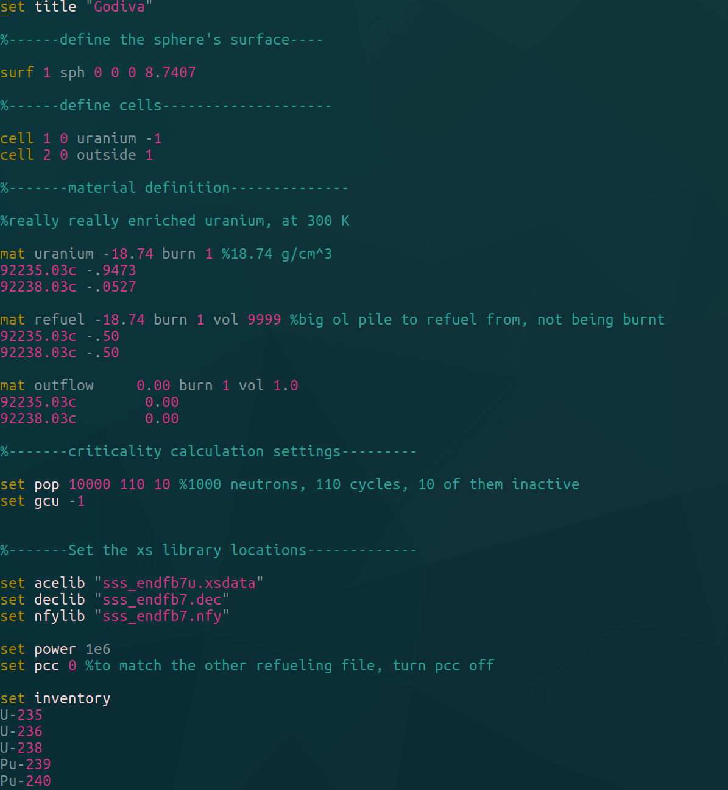

# serpent2vimsyntax
This repo contains a syntax file for vim to highlight  input files for the reactor physics code Serpent 2 from VTT.

Right now, this is only tested on a linux OS.

Wondering what Serpent 2 is? http://montecarlo.vtt.fi/

## How to install

### Manually

1. Copy the syntax/serp.vim file into either ~/.vim/syntax/ or \<vim_install_directory>/syntax/
1. Copy the ftdetect/serp.vim file into either ~/.vim/ftdetect/ or \<vim_install_directory>/ftdetect/
1. To update, copy over the serp.vim file with the new version.
1. Voila! Files ending in ".serp" will have highlighted serpent syntax.

### With Vundle

1. Follow instructions at [Vundle](https://github.com/VundleVim/Vundle.vim) to set up the plugin manager.
1. At the proper place in your `.vimrc` place:
    ```vim
    Plugin 'gridley/serpent2vimsyntax'
    ```
1. Install by opening Vim and using the command `:PluginInstall`.
1. Keep up-to-date with the command `:PluginUpdate`.
1. Voila! Files ending in ".serp" will have highlighted serpent syntax.
    
## Preview:



    
